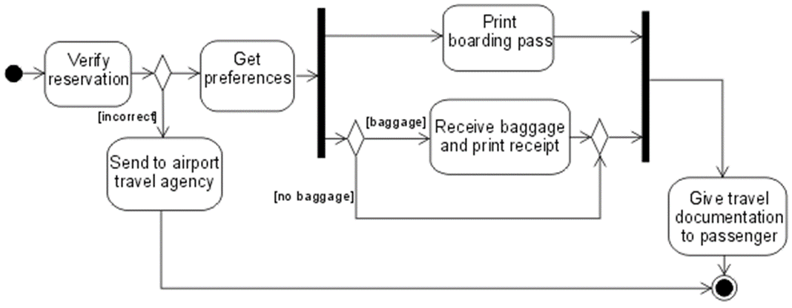
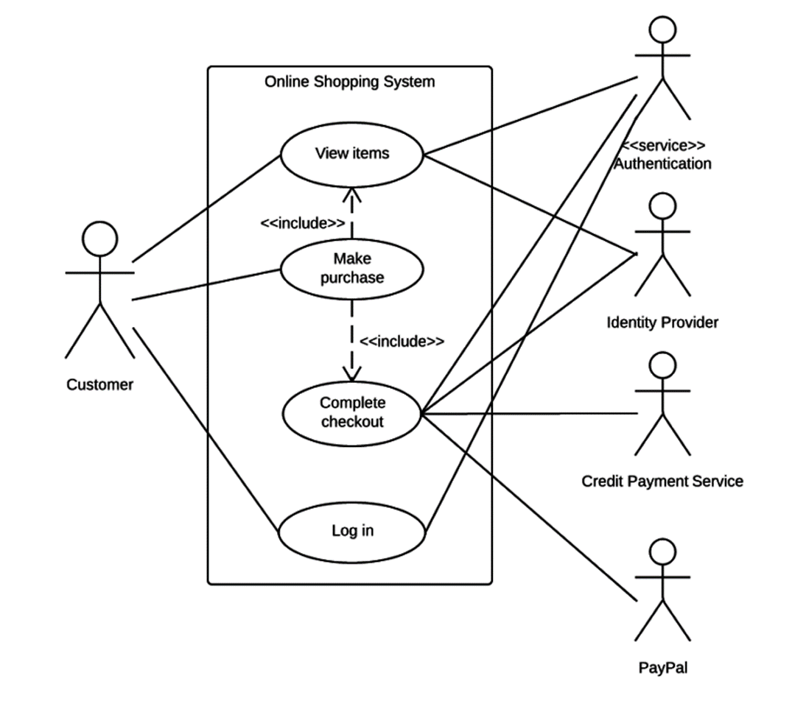
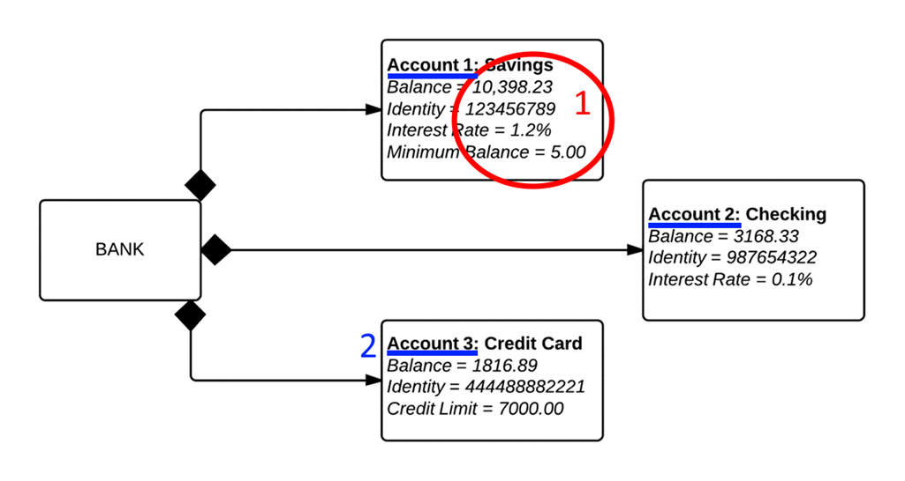

# UML Diagrams

[View this file as a PowerPoint presentation](https://1drv.ms/p/s!AjpvI1edrtIphoEtVtl5kyktEBMVkg)

## Background

- Communication is hard: using one consistent notation makes life easy
- Even smart people make mistakes
- We are focusing on the basics
- All you need to know:
  - Given a diagram, what type is it? (And vice versa)
  - Given a digram type, what is a brief description of what it does? (And vice versa)

## Overview

- Use case diagram
  - Describes how outside users interact with the system
  - Details what actions they can perform and what the system does in response
- Class diagram
  - Gives information about a class's variables and methods (both static and non-static, public and private)
  - Indicates the relationships between classes
  - Basically a diagram version of the code you write without the body of any methods, this is a very abstract diagram
- Object/instance diagram
  - Displays information about the objects in a program at one point during runtime
  - Concrete values will be present (e.g. "shoeSize: 16") in contrast to a class diagram ("shoeSize: Int")
- Activity/Control Flow
  - A decision tree that details how the logic within a method works
  - Basically a template for writing a method

## Questions

Identify the types of the following diagrams

### Diagram A

----

### Diagram B

----

### Diagram C

----

### Diagram D

## Answers

### Diagram A Answer

- We have concrete numbers: this cannot be a class diagram
- Repeat naming of the same class: each one corresponds to an _instance_ of that class

This is an object/instance diagram.

### Diagram B Answer

- Only one box per _class_
- No concrete numbers
- Methods are listed

This is a class diagram.

### Diagram C Answer

- This is a decision tree
- We have a clear start and end with some conditional branching and merging
- We see the _flow_ of the logic

This is an activity/control flow diagram.

(You don't need to know the names given in these annotations)

### Diagram D Answer

- Stick figures! (Or anything "outside the system")
- Interactions with the system, how the system is _used_

This is a use case diagram.

## Additional Resources

- [Lab 13, Exercise C](http://pages.cs.wisc.edu/~cs200/labs/labs201909/lab13/Lab13MoreClassesAndSpaceGame.pdf)
- The internet
- Lab 13, Exercise C. I cannot emphasize that enough.

## The End

Questions?
